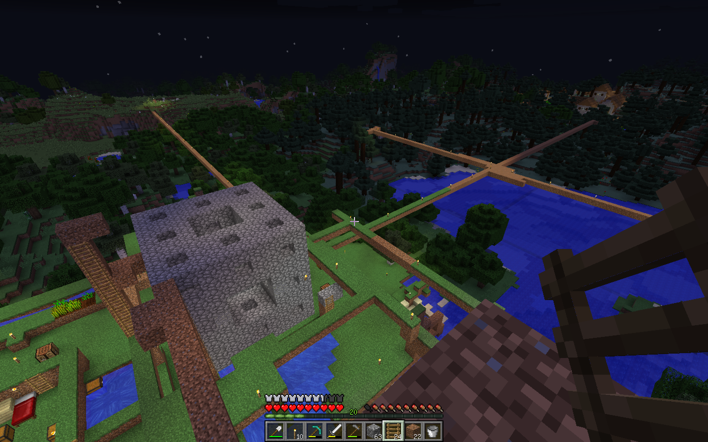

# マイクラでメンガーのスポンジを作る

Facebookで知人が<a href="https://en.wikipedia.org/wiki/Menger_sponge">メンガーのスポンジ</a>をマイクラで作っていることを知り、これだ！と直感した。

もともとメンガーのスポンジでは立方体に無限に細かく穴を空けていくことになるが、
マイクラでは細かく穴を空けられないので、無限に大きくしていくしかない。

試しに第2段階のスポンジを作ってみた。
これだけで数時間かかってしまった(写真)。

このメンガースポンジは3x3x3サイズの最小単位のモジュールを3x3x3に並べているのでレベル2と数える。
これと同じものをまた3x3x3に並べるとレベル3だ。

レベル2でも、正確かつ安全かつ高速に建造するためにどういう動きをすればいいか、
考えるのが大変おもしろい！
明かりを確保しつつ足場を作る。置き方を間違えたり操作をミスって落ちて死んだりした。
いまは落ちやすいところに水を張ってあるが。底面の全面を水にするとアクセスが悪くなるので工夫が必要だ。

素材は表面は丸石を使っているが、結構な量の閃緑岩や花崗岩などが出てくるので
中の方ではそれも使うことにした。
巨大な石の建造物を目指すのだ。

## ルール

マイクラは自分でルールを決めて楽しむゲームである。
これからどういうルールでやっていこうか。

実は建造物を作ること自体だけではなく、
建造物以外の既存地形がどう変化するかを見たい。
そのため資源を求めて環境を改変する必要があるルールが必要だ。

バニラ、ノーマル、サバイバルモードで、
できるだけバグ技やすぐに変更されてしまいそうな術を使わないようにする。
たとえばぎりぎりの微調整が必要な技などはバージョンアップで使えなくなるかもしれず美しくない。
「ああ、あのときはあの技が使えたが、いまは無理だから」みたいな感じだと歴史的価値が薄れてしまう。

とはいえ、マイクラにはバグなのか仕様なのか微妙な仕様も多いので、
いろいろなことを考えながら進めてみる。

## 作業量の見積もり

レベルを1段階増やすごとに、上面が8個,下面が8個、中段が4個で合計20個のモジュールが必要だ。必要な石の数は以下の通りである。

- レベル1: 20個の石　辺の長さ3m
- レベル2: 20^2=400個　辺の長さ9m
- レベル3: 20^3=8000個　辺の長さ27m
- レベル4: 20^4=16万個　辺の長さ81m
- レベル5: 20^5=320万個　辺の長さ243m
- レベル6: 20^6=6400万個 辺の長さ729m

現在のPC版マイクラであれば、レベル5の前あたりで全体を描画することができなくなるだろう。

では次に、この建造のために必要な素材やツール、食料、そして時間などについて考えていく。

## 次

レベル2までで使った丸石は、鉄やダイヤを探すときに余った石で十分足りた。
レベル3以降も、鉄やダイヤの無限増殖技を使わない場合は、
余った石だけで足りる可能性がある。
丸石は無限増殖できるが、必要ないかもしれない。

丸石は無限増殖がバニラの基本仕様で安定してできるので、
ゲームのルールとしては適していないようだ。

丸石以外の無限生成ができない石には閃緑岩・安山岩・花崗岩などがある。
これらは見た目も丸石よりも良いが埋蔵量が少ない。
では土や砂はどうか？

次は丸石でレベル3を目指すのもいいかと思ったが、
巨大化をする前の段階として、いろいろな素材で作ってみることにする。
土は穴の中に草が生えて面白い絵になりそうなのでやってみたいのと、
またガラスも見た目に美しくなりそうなのでぜひやってみたい。
特に砂を海底から集めるのが環境を大幅に変えてしまいそうなので挑戦してみる。
